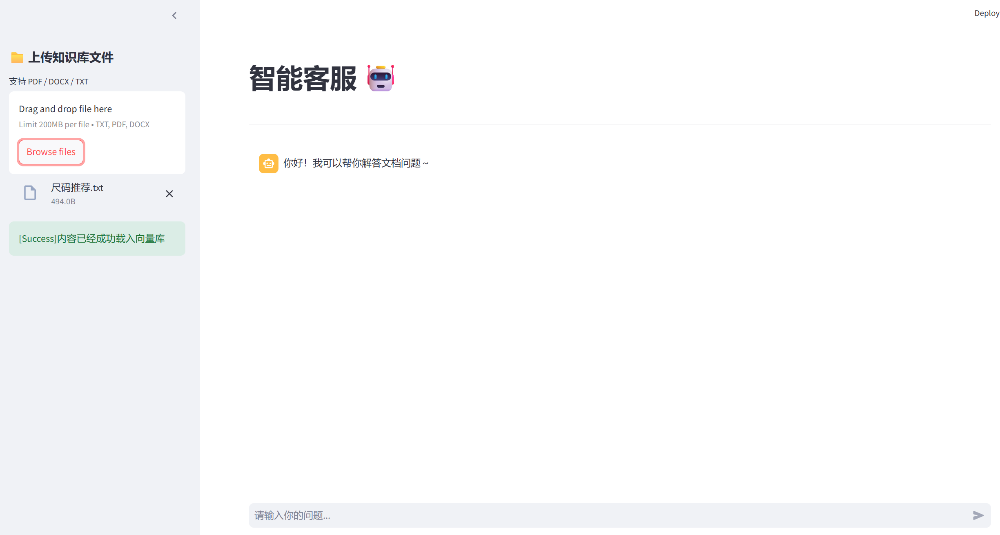
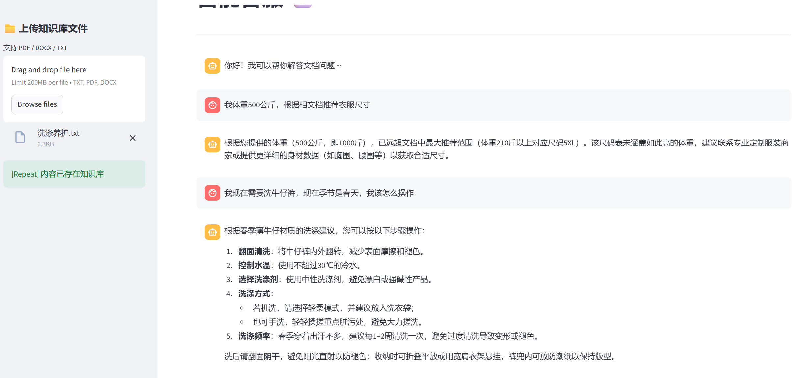

# FashionRAG-LLM-System 电商服饰智能问答客服系统
专为服装电商打造的 RAG 智能客服，可自动回答尺码、面料、洗涤、售后、搭配等问题。
 ## 基于 Streamlit + LangChain 的本地智能知识库问答系统
一站式文件上传 + RAG 检索增强问答系统，单页面完成文档上传、实时入库、流式对话、多轮记忆
- 在网页端上传 `TXT / PDF / DOCX（Word）` 文件，自动切分后写入 Chroma 向量库
- 在网页端以聊天形式提问，基于知识库内容进行检索增强回答（RAG） 
- 支持 会话历史查看，流式思维链输出
- 技术栈：Python / Streamlit / LangChain / Chroma / Embeddings / Qwen ChatModel

---

## 业务场景
- 用户咨询衣服尺码
- 询问面料是否透气、是否起球
- 洗涤方式、保养说明
- 退换货政策
- 风格搭配建议

---


## ✨ 功能一览

### 1) 知识库更新服务（Upload）
- Streamlit 页面上传服饰知识库 → 自动构建专业客服问答
- 自动读取文本内容
- 根据配置进行分段（RecursiveCharacterTextSplitter）
- 写入 Chroma 向量库（本地持久化）
- 使用 **MD5 去重**：相同内容不重复入库

### 2) 智能客服（RAG Chat）
- 显示历史消息（session_state）
- LangChain 链式调用：`Retrieval -> Prompt -> LLM -> Output`
- 支持多轮对话，上下文理解
- 基于真实业务规则回答，不胡说
- 实时更新知识库，无需重启
- 支持 **流式输出**
- 支持 **消息历史文件存储**（FileChatMessageHistory）

### 3) 效果预览（demo）
---
<!-- 智能客服示例图 -->
<div align="left">
  
</div>

- 本地知识库预存了衣物尺码推荐表、材质维护、穿衣搭配等示例内容（data见assets）
- 对标电商，可按个人需求替换为自己的业务文本
---
<div align="left">
  
</div>

- 支持结合历史消息进行连续问答

---


## 🧩 项目结构

```text
EasyRAG-main/
├── app_chat.py              # 主程序（一体化页面：上传 + 对话）
├── file_parser.py           # 多格式文档解析器（TXT/PDF/DOCX）
├── knowledge_base.py        # 文档处理、切片、MD5去重、向量入库
├── rag.py                   # RAG 核心链、对话历史管理
├── vector_stores.py         # Chroma 向量库封装
├── file_history_store.py    # 对话历史本地存储
├── config_data.py           # 全局配置
├── requirements.txt         # 依赖包
└── README.md                # 说明文档例素材文本所在
```
---
## ✅ 环境准备

### 1) 安装依赖
```bash
pip install -r requirements.txt -i https://pypi.tuna.tsinghua.edu.cn/simple
```
- 终端运行，建议虚拟环境加载，清华镜像源加速
---

## ⚙️ 配置说明

- config_data.py 中包含核心配置，根据实际需要，手动修改模型配置、chunk大小...
- 默认嵌入器 text-embedding-v4 及 Qwen3-max
- 注意，DashScope/通义千问相关的 API Key（例如 DASHSCOPE_API_KEY）需要在环境变量中先行配置
---

## 🚀 快速运行

###  启动智能客服（RAG Chat）
```bash
streamlit run app_chat.py
```
- 输入问题后，会先检索知识库，再结合检索内容由模型综合回答
---

## 🛠 常见问题

### Q1：上传文件后，聊天问答仍然像“没有检索到资料”？
#### 可能原因：
- 上传服务和问答服务使用了不同的向量库持久化目录
- `collection_name` 配置不一致
- 上传文件后未正确写入本地数据目录

### Q2：上传文件后，回答显示较慢或没有正常输出？
#### 可能原因：
- 文本切分参数或检索参数设置不合适，调整chunk、检索k...
- 模型接口或网络请求响应较慢
- 本地向量库未正确初始化

### Q3：项目运行报路径或配置错误怎么办？
#### 建议优先检查：
- `config_data.py` 中的模型配置、路径配置是否正确
- 本地数据目录是否存在
- API Key 是否已配置到环境变量

---
## ✨ 优化方向（仅供参考）
- 增加深度Rerank，提升检索结果质量，比如langchain框架中提供的EGE rerank模块
- 优化Streamlit页面交互与展示，Streamlit内置功能丰富，可按需丰富UI
- 支持更多文件类型（多模态），如PDF / Markdown / Word，增加langchain插件即可轻松实现
- 思维链 -> 思维树 ？
- 单模型 -> 多模型 ？ 例如豆包的多层推理架构，多模型混合输出？
- Chroma -> FAISS ?  这里采用轻量Chroma适合个人复现，FAISS的高效检索则适配企业
- 待定...
- 总之，这是一个基础但延展性很好的RAG项目,扩展升级 -> 企业级RAG -> 功能插件 -> Agent -> AI产品

---


## 📄 License

- 本项目仅用于学习与交流，如需商用请自行补全安全、合规与授权相关内容。
---

## 🙌 致谢

- Black Horse
- Streamlit
- LangChain
- Chroma / chromadb
- Aliyun Bai / qwen
